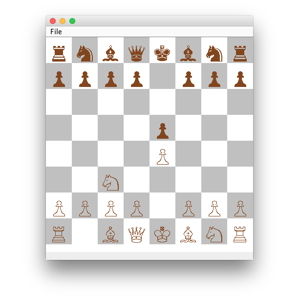

# Chess

A lightweight, extensible Java-based chess application featuring:

- **Multiple game modes**: Human vs Bot, Human vs Human, Bot vs Bot  
- **Unicode piece rendering** with crisp, scalable board graphics  
- **Swing-based GUI** with optional screenshot below  

---

## Extensibility & Overhauls

- **Swappable Bots**: drop your own `Player` implementation under `botIntelligence/`.  
- **Modular GUI**: view and controller components communicate via minimal interfaces—feel free to replace Swing with JavaFX or web front-end.  